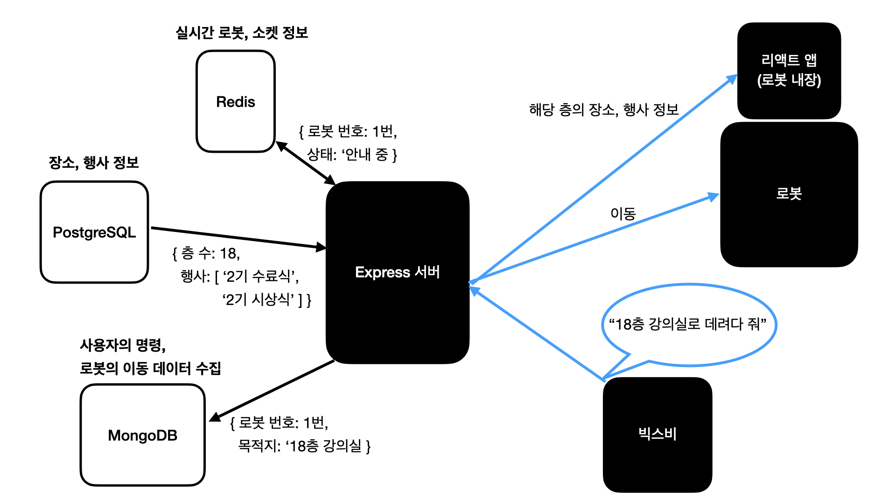

# BrrBrr - Backend server

## 서버 구조도

## 우리 서버의 특징

- 사용자 인풋이 빅스비라는 서비스를 통해 들어오기 때문에 각 서비스를 동기화하는 것이 가장 중요!
- 단순한 요청 - 응답 으로는 한계가 있어 이벤트 기반의 아키텍처로 설계
- 로봇과의 커뮤니케이션 시 메시지 브로커가 필요할 수 있음 (ex. RabbitMQ, NATS, Kafka)

## 서버 상세 기술

### SocketIO

- 기존 Websocket의 단점을 보완해 라이브러리
- 백엔드 서버와 프론트 페이지 연결에 사용
- 이벤트 기반의 메시지 전달로 프론트 페이지를 변경

### Node cluster

- 싱글 스레드인 Node 서버의 단점을 보완
- 여러 대의 로봇과 연결되었을 때 멀티스레드를 구현하여 서버의 부하 감소

## DB 스키마

### 장소 정보 (Place in PostgreSQL)

|칼럼명|데이터 타입|설명|키 설명|
|---|---|---|---|
|id|Int|고유 ID||
|name|String|이름|PK|
|description|String|설명||
|floor|Int|층 수|PK|
|xaxis|Float|SLAM 지도 위 X 좌표||
|yaxis|Float|SLAM 지도 위 Y 좌표||
|thumburl|String|썸네일 이미지 URL||
|mapurl|String|약도 이미지 URL||

### 행사 정보 (Event in PostgreSQL)

|칼럼명|데이터 타입|설명|키 설명|
|---|---|---|---|
|id|Int|고유 ID||
|name|String|이름|PK|
|description|String|설명||
|starttime|Datetime|행사 시작 시간||
|endtime|Datetime|행사 종료 시간||
|placeName|String|행사가 열리는 장소 이름|FK|
|placeFloor|Int|행사가 열리는 층 수|FK|

### 로봇 정보 (Robot in PostgreSQL)

칼럼명|데이터 타입|설명|키 설명|
|---|---|---|---|
|id|Int|고유 ID||
|name|String|이름|PK|
|floor|Int|로봇이 위치한 층 수||

### 로그 정보 (Log in MongoDB)

- 작성 예정

### 실시간 로봇 상태 (Robot in Redis)

|키|값|
|---|---|
|robot|[{id: Int, code: Int, floor: Int, available: true/false, status: '대기'/'이동중'/'도착'}]|

