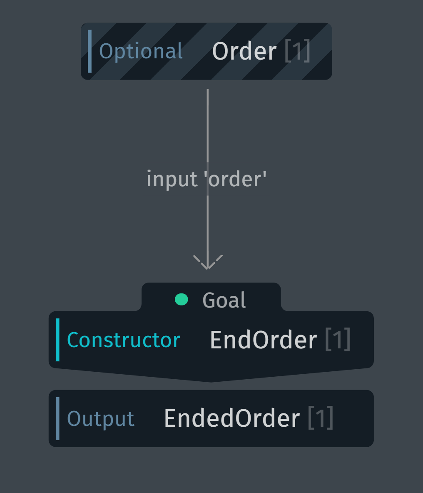

# BrrrBrrr Broombroom 💋

 


## Usage

```
1. 스마트폰의 Bixby를 실행합니다.
2. 부릉부릉 캡슐을 검색 후 추가합니다.
3. Bixby에게 다음과 같이 음성으로 말합니다. 부릉부릉 시작!
```

  


## Service
자율주행 안내 로봇 '로미'에게 안내를 받기 위해 Bixby를 통해 음성으로 로미와 대화할 수 있습니다.

로미에게 '싸피 게시판이 어디야?', '1001호 강의실로 안내해줘'와 같은 발화를 건네면 로미는 이러한 장소에 대해 직접 안내해주거나 위치를 알려줍니다!


### 인증
현재 눈 앞에 있는 로미에게 안내를 받기 위해서 로미를 인증해야 합니다. 로미의 LCD 패널에 표시되는 인증번호를 적어주세요.


### 안내/투어 선택
- 안내 : 안내를 받을 수 있는 장소/행사로 안내 서비스를 받을 수 있습니다.
- 투어 : 지정된 투어 코스를 따라서 장소/행사에 대한 설명을 들으며 투어합니다.

현재 투어 서비스는 사용이 불가능하며, 안내 서비스를 이용하실 수 있습니다.


### 장소/행사 선택
- 장소 : 현재 로미가 있는 층에서 이동할 수 있는 장소의 리스트를 확인할 수 있습니다.
- 행사 : 로미가 있는 건물 내에서 오늘 진행하고 있는 행사의 리스트를 확인할 수 있습니다.


 

### 이동 및 도착
- 이동 : 로미와 함께 목적지를 향해 이동합니다.
- 도착 : 이동 중에 목적지에 도착하게 되면 도착 버튼을 눌러 목적지에 대한 자세한 설명을 듣습니다.

 

## Flow


## Bixby flow

### 인증

- 사용자가 입력한 코드(AuthenticationCode)를 받아 서버에 인증 유효성 유무를 요청합니다.
- 서버로부터 응답을 받아 order에 인증 상태를 저장하고(UpdateOrder), 인증 성공 혹은 실패 페이지를 보여줍니다.


### 서비스 선택

- 사용자가 선택한 서비스(GuideType)를 받아 장소, 행사 데이터를 서버에 요청합니다.
- 서버로부터 응답을 받아 order에 장소, 행사 정보를 저장하고(UpdateOrder) 목적지 선택 페이지를 보여줍니다.


### 목적지 선택

- 사용자가 선택한 목적지(SearchTerm)를 받아 특정 장소, 행사의 세부 사항 정보를 요청합니다.
- 서버로부터 응답을 받아 order에 목적지의 세부 정보(Destination)를 저장하고(UpdateOrder) 이동중 페이지를 보여줍니다.


### 이동 및 도착

- 사용자가 이동 중 페이지에서 도착 버튼을 눌렀을시 로봇의 도착 여부에 대한 정보를 요청합니다.
- 서버로부터 응답을 받아 order에 로봇의 현재 상태(CurrentRobotState)를 저장하고(UpdateOrder), 도착 혹은 이동중 페이지를 보여줍니다.


### 서비스 종료

- 사용자가 서비스를 다 이용하고 난 후 서버에 서비스 종료를 요청합니다.
- 서버로부터 정상 종료 응답을 받고, 종료 페이지를 보여줍니다.

