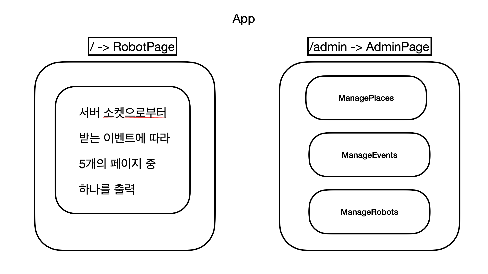
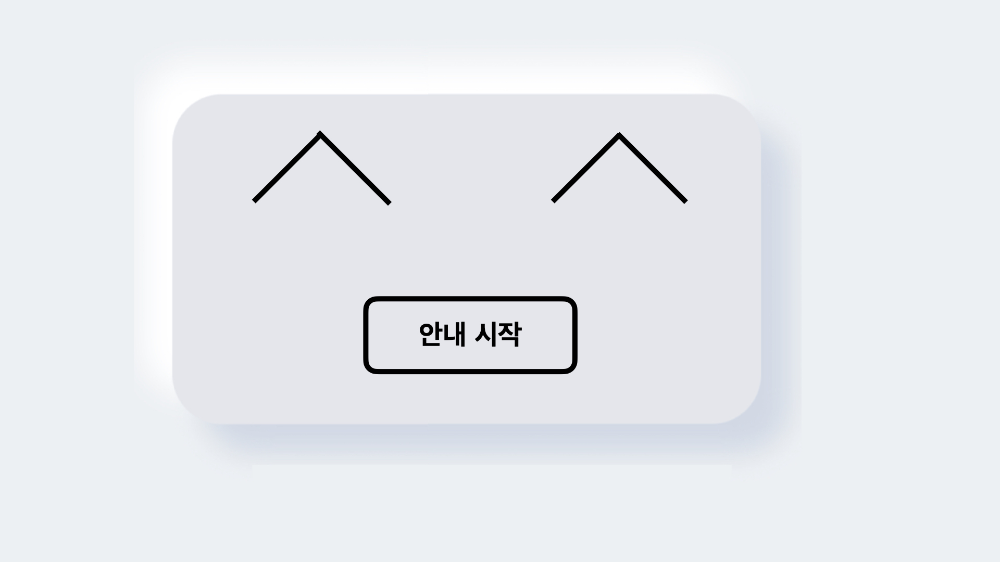
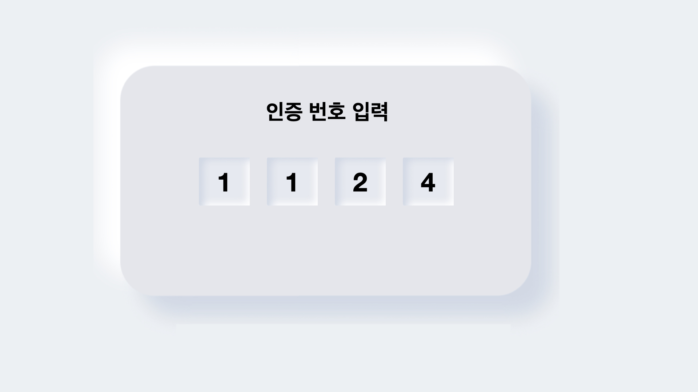
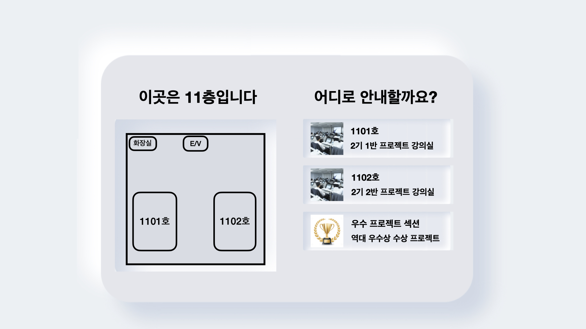
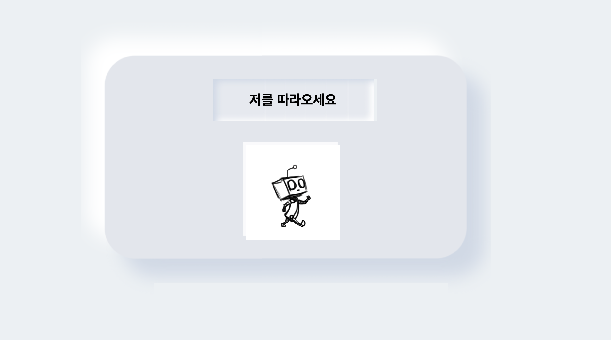
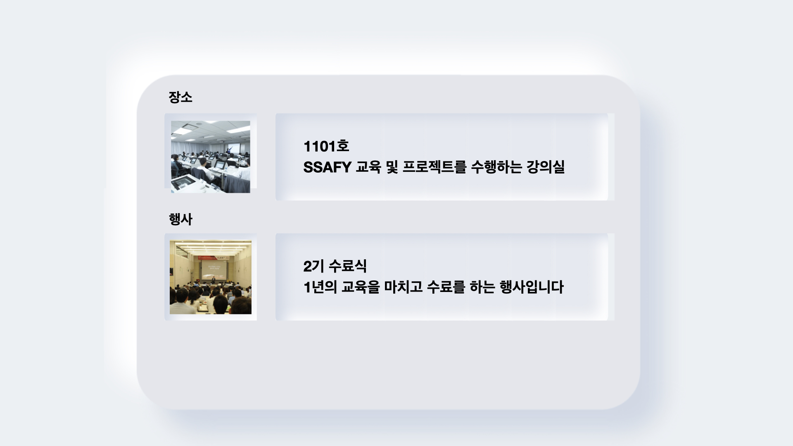

# BrrBrr - front page for user on robot

## 컴포넌트 구조

## 와이어프레임

### HomePage

- 사용자가 보는 메인 화면

### AuthCodePage

### ListOnFloorPage

### GuidePage

### DestinationPage

## 사용가능한 명령어

- `yarn start`
  - 개발 서버를 실행합니다 기본 포트는 3000입니다
- `yarn test`
  - interactive watch mode 로 테스트 러너를 실행합니다
- `yarn build`
  - 실 서비스용 파일을 빌드합니다
- `yarn eject`
  - 빌드 툴을 커스터마이징합니다
